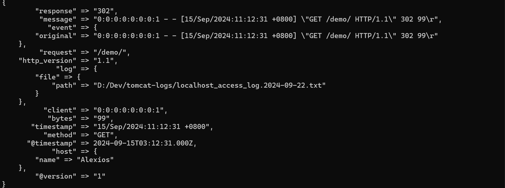
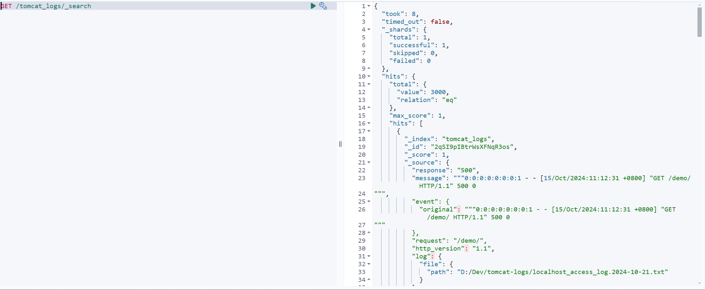
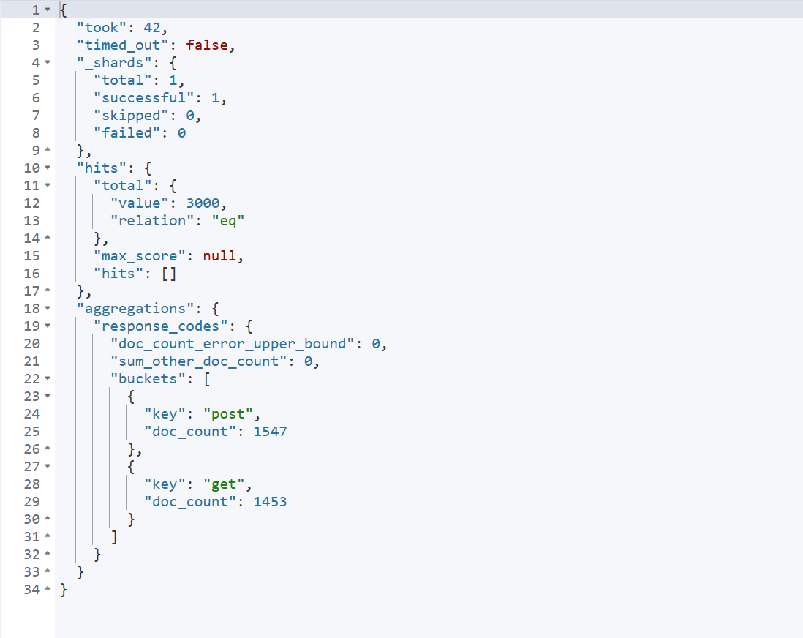
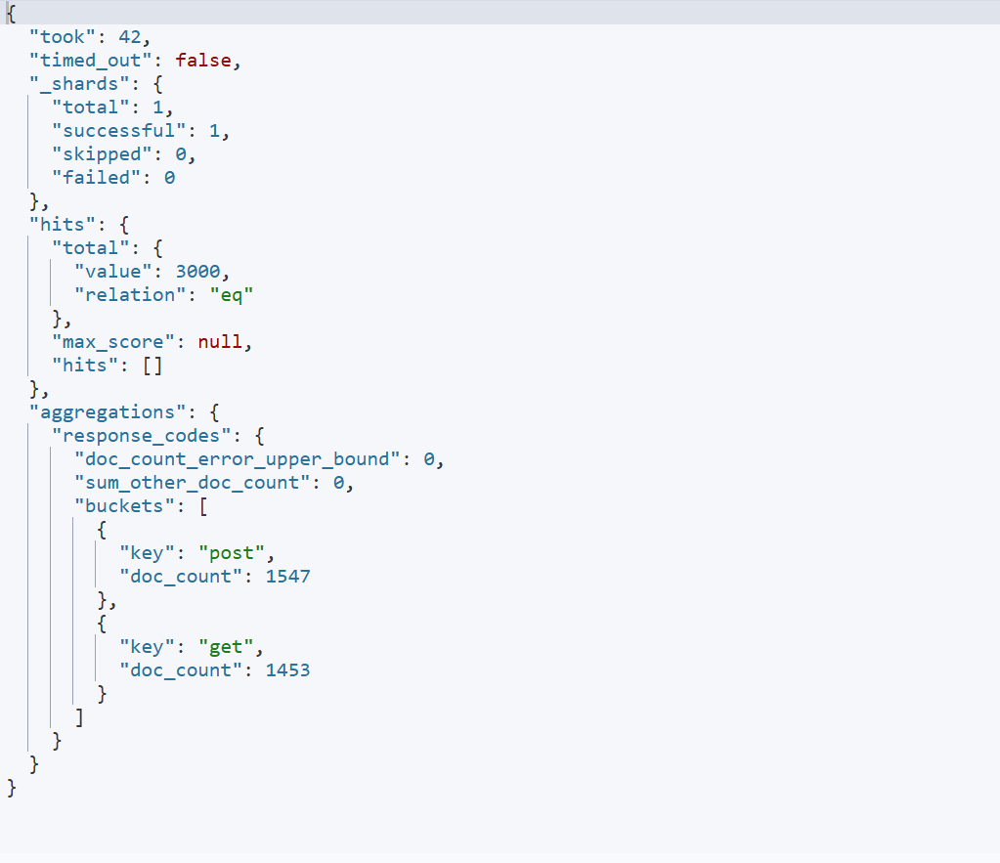
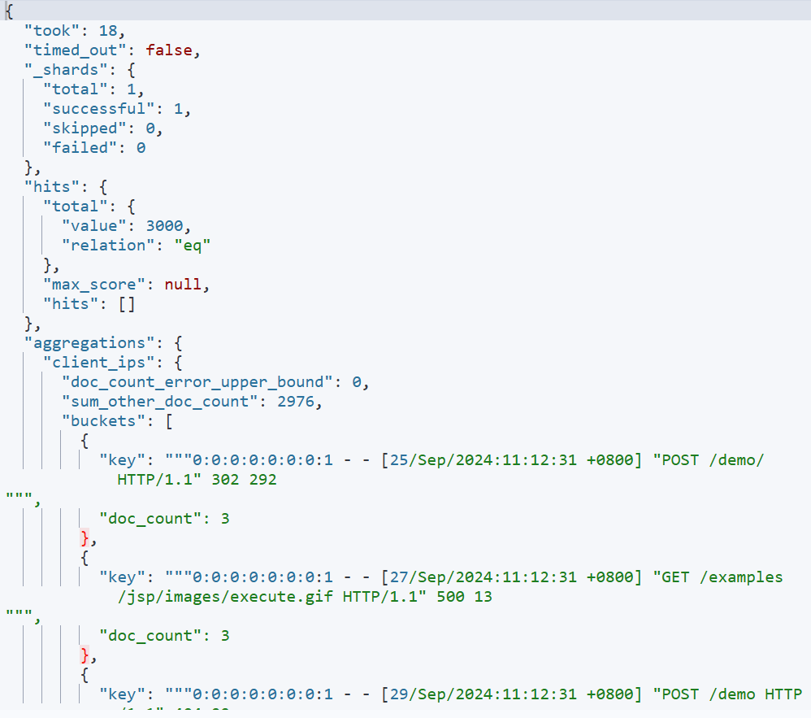
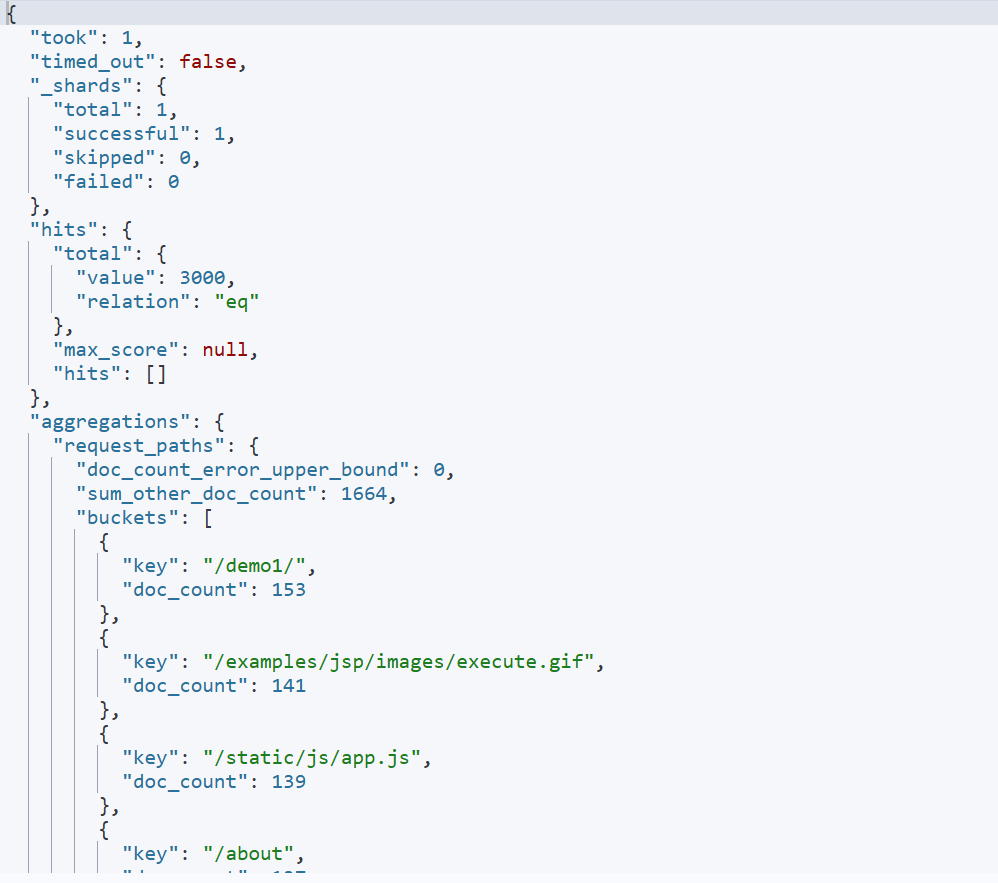
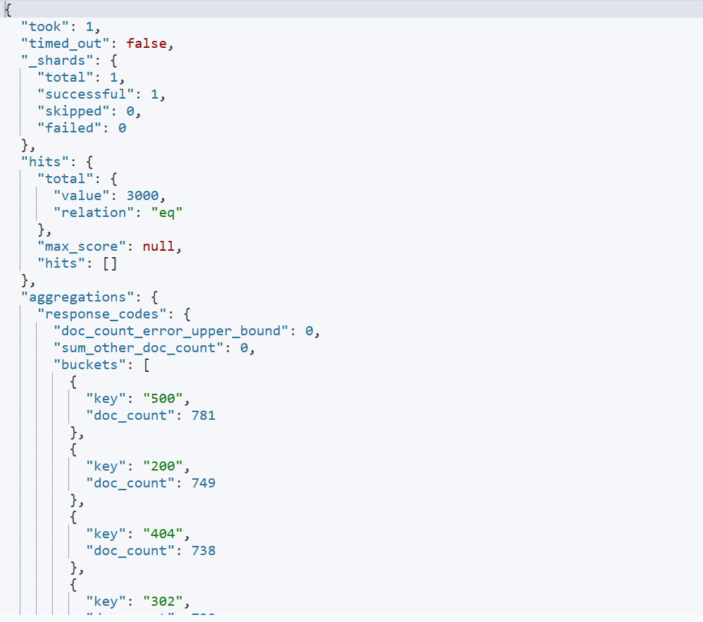
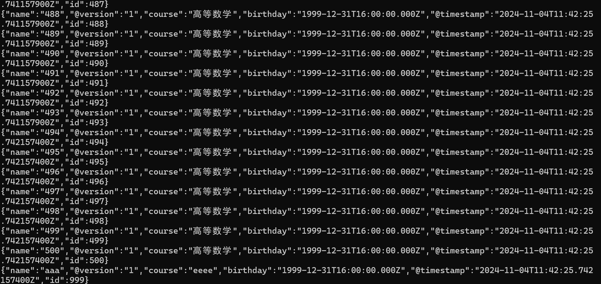

# 《 实验四: Logstash操作》

> **学院：省级示范性软件学院**
>
> **课程：高级数据库技术与应用**
>
> **题目：**《  实验四: Logstash操作》
>
> **姓名：** 刘双硕
>
> **学号：** 2100150421
>
> **班级：** 软工2201
>
> **日期：** 2024-11-10
>
> **实验环境：** elasticsearch-8.12.2 kibana-8.12.2 logstash-8.12.2

## 一、实验目的

- 掌握logstash 输入
- 掌握logstash 过滤
- 掌握logstash 输出

## 二、实验内容

### tomcat日志处理

#### 将tomcat的logs中的localhost_access_log访问日志导入到本地的elasticsearch中。


配置文件如下:

```json
input{
	file{
		path => "D:/Dev/tomcat-logs/*.txt" # 日志文件的路径
		start_position => "beginning"
	}
}

filter {
  grok {
    match => { "message" => "%{IPV6:client} - - \[%{HTTPDATE:timestamp}\] \"%{WORD:method} %{URIPATH:request} HTTP/%{NUMBER:http_version}\" %{NUMBER:response} (?:%{NUMBER:bytes}|-)" }
  }
  date {
    match => [ "timestamp", "dd/MMM/yyyy:HH:mm:ss Z" ]
	target => "@timestamp"
  }
}

output {
  elasticsearch {
    hosts => ["http://localhost:9200"] # Elasticsearch 地址
    index => "tomcat_logs" # 索引名称
  }
  stdout { codec => rubydebug }  # 输出到控制台，便于调试
}
```

#### 数据导入到一个名为tomcat_logs的索引。

导入后控制台输出如下:



在es中可以查询到数据



#### 在elasticsearch中做5个日志相关的分析，题目自拟。

##### 按请求方法聚合

代码:

```json
POST /tomcat_logs/_search?
{
  "size": 0,
  "aggs": {
    "response_codes": {
      "terms": {
        "field": "method"
      }
    }
  }
}
```

聚合结果:



##### 按时间范围聚合

代码:

```json
POST /tomcat_logs/_search?
{
  "size": 0,
  "aggs": {
    "requests_over_time": {
      "date_histogram": {
        "field": "@timestamp",
        "calendar_interval": "hour"
      }
    }
  }
```

聚合结果:



##### 按信息进行聚合

代码:

```json
POST /tomcat_logs/_search?
{
  "size": 0,
  "aggs": {
    "client_ips": {
      "terms": {
        "field": "message.keyword"
      }
    }
  }
}
```

聚合结果:



##### 按请求路径聚合

代码:

```json
POST /tomcat_logs/_search?
{
  "size": 0,
  "aggs": {
    "request_paths": {
      "terms": {
        "field": "request.keyword"
      }
    }
  }
}
```

聚合结果:



##### 按响应码进行聚合

代码:

```json
POST /tomcat_logs/_search?
{
  "size": 0,
  "aggs": {
    "response_codes": {
      "terms": {
        "field": "response.keyword"
      }
    }
  }
}
```

聚合结果:



### 数据转换和传输

#### 将本地的mysql数据库中的一张表导入到本地的elasticsearch中。

配置文件:

```json
input {
  jdbc {
    jdbc_driver_library => "E:/develop/logstash-8.12.2/jars/mysql-connector-j-9.1.0.jar"
    jdbc_driver_class => "com.mysql.cj.jdbc.Driver"
    jdbc_connection_string => "jdbc:mysql://localhost:3306/test"
    jdbc_user => "root"
    jdbc_password => "123456"
    statement => "SELECT * FROM teacher"
    schedule => "*/5 * * * * *" # 每5秒运行一次
  }
}

output {
  elasticsearch {
    hosts => ["http://localhost:9200"]
    index => "teacher"
    document_id => "%{id}" # 假设 student 表有一个 id 字段作为主键
  }
  stdout { codec => json_lines }
}
```

控制台:


#### 数据库表更新后，数据能够自动同步到elasticsearch中。



## 三、问题及解决办法

在使用请求方法聚合时,无法进行聚合

请求方法字段method 为 text,无法直接进行聚合,修改后可以进行聚合

```json
PUT /tomcat_logs/_mapping
{
  "properties": {
    "method": {
      "type": "text",
      "fielddata": true
    }
  }
}
```

