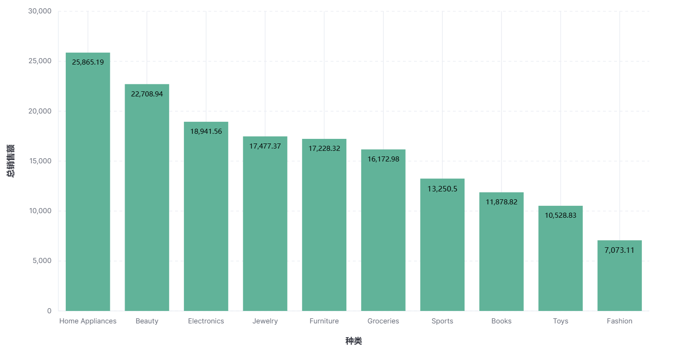

# 《实验五 Kibana 操作》

> **学院：省级示范性软件学院**
>
> **课程：高级数据库技术与应用**
>
> **题目：**《实验五: Kibana 操作练习》
>
> **姓名：** 刘双硕
>
> **学号：** 2100150421
>
> **班级：** 软工2201
>
> **日期：** 2024-11-20
>
> **实验环境：** elasticsearch-8.12.2 kibana-8.12.2 

## 一、实验目的

通过本次实验了解Kibana的基本操作并通过它对存储在 Elasticsearch 中的数据进行可视化分析。

## 二、实验内容

### 使用Kibana完成实验三 聚合操作的 10道题

#### 统计每个产品类别的总销售额。

#### 计算每个城市的平均订单金额。

#### 找出销量最高的前5个产品。

#### 计算男性和女性客户的平均年龄。

#### 统计每种支付方式的使用次数和总金额。

#### 计算每月的总销售额。

#### 找出平均订单金额最高的前3个客户。

#### 计算每个年龄段（18-30，31-50，51+）的客户数量。

#### 计算每个产品类别的平均单价。

#### 找出订单数量最多的前5个城市。

### 制作仪表盘

## 三、问题及解决办法

### 问题

对于统计每种支付方式的使用次数和总金额,无法在一张图例中同时显示使用次数和总金额.

### 解决办法

建立两个图层,并且修改第二个垂直轴的轴侧为右侧,即可同时显示.
